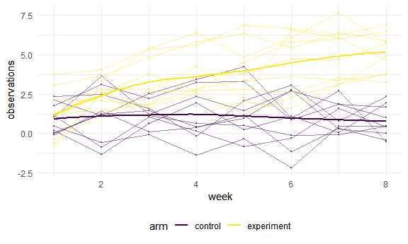
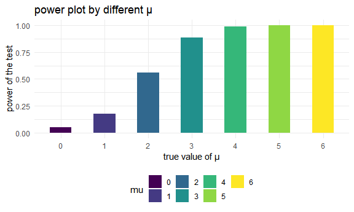
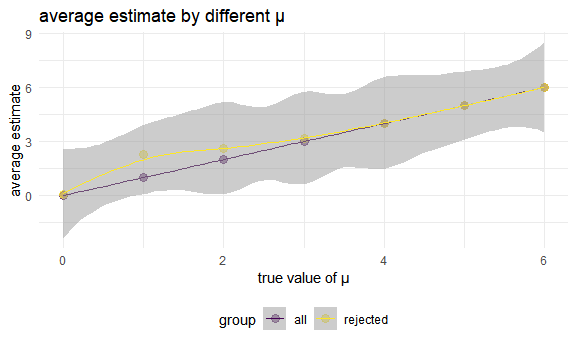

p8105\_hw5\_cy2588
================
Chufeng Yang
2020/11/14

## Problem 1

### Solution 1

Read in the data.

``` r
homicide_df = 
  read_csv("p1_data/homicide-data.csv") %>% 
  mutate(
    city_state = str_c(city, state, sep = "_"),
    resolved = case_when(
      disposition == "Closed without arrest" ~ "unsolved",
      disposition == "Open/No arrest"        ~ "unsolved",
      disposition == "Closed by arrest"      ~ "solved",
    )
  ) %>% 
  select(city_state, resolved) %>% 
  filter(city_state != "Tulsa_AL")
```

    ## Parsed with column specification:
    ## cols(
    ##   uid = col_character(),
    ##   reported_date = col_double(),
    ##   victim_last = col_character(),
    ##   victim_first = col_character(),
    ##   victim_race = col_character(),
    ##   victim_age = col_character(),
    ##   victim_sex = col_character(),
    ##   city = col_character(),
    ##   state = col_character(),
    ##   lat = col_double(),
    ##   lon = col_double(),
    ##   disposition = col_character()
    ## )

Summarize

``` r
aggregate_df = 
  homicide_df %>% 
  group_by(city_state) %>% 
  summarize(
    hom_total = n(),
    hom_unsolved = sum(resolved == "unsolved")
  )
```

    ## `summarise()` ungrouping output (override with `.groups` argument)

prop test for a single city

``` r
prop.test(
  aggregate_df %>% filter(city_state == "Baltimore_MD") %>% pull(hom_unsolved), 
  aggregate_df %>% filter(city_state == "Baltimore_MD") %>% pull(hom_total)) %>% 
  broom::tidy()
```

    ## # A tibble: 1 x 8
    ##   estimate statistic  p.value parameter conf.low conf.high method    alternative
    ##      <dbl>     <dbl>    <dbl>     <int>    <dbl>     <dbl> <chr>     <chr>      
    ## 1    0.646      239. 6.46e-54         1    0.628     0.663 1-sample~ two.sided

Iterate

``` r
results_df = 
  aggregate_df %>% 
  mutate(
    prop_tests = map2(.x = hom_unsolved, .y = hom_total, ~prop.test(x = .x, n = .y)),
    tidy_tests = map(.x = prop_tests, ~broom::tidy(.x))
  ) %>% 
  select(-prop_tests) %>% 
  unnest(tidy_tests) %>% 
  select(city_state, estimate, conf.low, conf.high)
```

Create a plot

``` r
results_df %>% 
  mutate(city_state = fct_reorder(city_state, estimate)) %>% 
  ggplot(aes(x = city_state, y = estimate)) +
  geom_point() + 
  geom_errorbar(aes(ymin = conf.low, ymax = conf.high)) + 
  theme(axis.text.x = element_text(angle = 90, vjust = 0.5, hjust = 1))
```


### Solution 2

Clean the data

``` r
homicide_df_2 = 
  read_csv("p1_data/homicide-data.csv") %>% 
  mutate(
    city_state = str_c(city, state, sep = "_"),
    resolved = case_when(
      disposition == "Closed without arrest" ~ "unsolved",
      disposition == "Open/No arrest"        ~ "unsolved",
      disposition == "Closed by arrest"      ~ "solved",
    )
  ) %>% 
  select(city_state, resolved) %>% 
  filter(city_state != "Tulsa_AL") %>% 
  nest(data = resolved)
```

    ## Parsed with column specification:
    ## cols(
    ##   uid = col_character(),
    ##   reported_date = col_double(),
    ##   victim_last = col_character(),
    ##   victim_first = col_character(),
    ##   victim_race = col_character(),
    ##   victim_age = col_character(),
    ##   victim_sex = col_character(),
    ##   city = col_character(),
    ##   state = col_character(),
    ##   lat = col_double(),
    ##   lon = col_double(),
    ##   disposition = col_character()
    ## )

Build a function of prop test

``` r
city_prop_test = function(df) {
  
  n_unsovled = as.numeric(summarize(df,sum(resolved == "unsolved")))
  n_total = as.numeric(summarize(df,n()))
  
  prop.test(n_unsovled, n_total)
  
}
```

map function with data

``` r
results_df_2 = 
  homicide_df_2 %>% 
  mutate(
    prop_tests_2 = map(homicide_df_2$data, city_prop_test),
    tidy_tests_2 = map(.x = prop_tests_2, ~broom::tidy(.x))
) %>%
  select(-prop_tests_2) %>% 
  unnest(tidy_tests_2) %>% 
  select(city_state, estimate, conf.low, conf.high)
```

Create a plot

``` r
results_df_2 %>% 
  mutate(city_state = fct_reorder(city_state, estimate)) %>% 
  ggplot(aes(x = city_state, y = estimate)) +
  geom_point() + 
  geom_errorbar(aes(ymin = conf.low, ymax = conf.high)) + 
  theme(axis.text.x = element_text(angle = 90, vjust = 0.5, hjust = 1))
```


## Problem 2

Start with a dataframe containing data from all participants

``` r
path_df = 
  tibble(
    path = list.files("p2_data"),
  )
```

Iterate over file names and read in data

``` r
lda_data = 
  path_df %>%
  mutate(
    path = str_c("p2_data/", path),
    data = map(path, read.csv)) %>%
  unnest(data)
lda_data
```

    ## # A tibble: 20 x 9
    ##    path               week_1 week_2 week_3 week_4 week_5 week_6 week_7 week_8
    ##    <chr>               <dbl>  <dbl>  <dbl>  <dbl>  <dbl>  <dbl>  <dbl>  <dbl>
    ##  1 p2_data/con_01.csv   0.2  -1.31    0.66   1.96   0.23   1.09   0.05   1.94
    ##  2 p2_data/con_02.csv   1.13 -0.88    1.07   0.17  -0.83  -0.31   1.58   0.44
    ##  3 p2_data/con_03.csv   1.77  3.11    2.22   3.26   3.31   0.89   1.88   1.01
    ##  4 p2_data/con_04.csv   1.04  3.66    1.22   2.33   1.47   2.7    1.87   1.66
    ##  5 p2_data/con_05.csv   0.47 -0.580  -0.09  -1.37  -0.32  -2.17   0.45   0.48
    ##  6 p2_data/con_06.csv   2.37  2.5     1.59  -0.16   2.08   3.07   0.78   2.35
    ##  7 p2_data/con_07.csv   0.03  1.21    1.13   0.64   0.49  -0.12  -0.07   0.46
    ##  8 p2_data/con_08.csv  -0.08  1.42    0.09   0.36   1.18  -1.16   0.33  -0.44
    ##  9 p2_data/con_09.csv   0.08  1.24    1.44   0.41   0.95   2.75   0.3    0.03
    ## 10 p2_data/con_10.csv   2.14  1.15    2.52   3.44   4.26   0.97   2.73  -0.53
    ## 11 p2_data/exp_01.csv   3.05  3.67    4.84   5.8    6.33   5.46   6.38   5.91
    ## 12 p2_data/exp_02.csv  -0.84  2.63    1.64   2.58   1.24   2.32   3.11   3.78
    ## 13 p2_data/exp_03.csv   2.15  2.08    1.82   2.84   3.36   3.61   3.37   3.74
    ## 14 p2_data/exp_04.csv  -0.62  2.54    3.78   2.73   4.49   5.82   6      6.49
    ## 15 p2_data/exp_05.csv   0.7   3.33    5.34   5.57   6.9    6.66   6.24   6.95
    ## 16 p2_data/exp_06.csv   3.73  4.08    5.4    6.41   4.87   6.09   7.66   5.83
    ## 17 p2_data/exp_07.csv   1.18  2.35    1.23   1.17   2.02   1.61   3.13   4.88
    ## 18 p2_data/exp_08.csv   1.37  1.43    1.84   3.6    3.8    4.72   4.68   5.7 
    ## 19 p2_data/exp_09.csv  -0.4   1.08    2.66   2.7    2.8    2.64   3.51   3.27
    ## 20 p2_data/exp_10.csv   1.09  2.8     2.8    4.3    2.25   6.57   6.09   4.64

Tidy the result

``` r
lda_data_tidy = 
  lda_data %>%
  mutate(
    path = str_remove_all(path,".csv")
  )%>%
  separate(path, into = c("arm","id"), sep = 11)%>%
  mutate(
    arm = str_remove_all(arm, "p2_data/"),
    id = str_remove_all(id, "_"),
    arm = str_replace(arm,"con","control"),
    arm = str_replace(arm,"exp","experiment")
  )%>%
  pivot_longer(
    week_1:week_8,
    names_prefix = "week_",
    names_to = "week",
    values_to = "observations"
  )%>%
  mutate(week = as.numeric(week))
lda_data_tidy
```

    ## # A tibble: 160 x 4
    ##    arm     id     week observations
    ##    <chr>   <chr> <dbl>        <dbl>
    ##  1 control 01        1         0.2 
    ##  2 control 01        2        -1.31
    ##  3 control 01        3         0.66
    ##  4 control 01        4         1.96
    ##  5 control 01        5         0.23
    ##  6 control 01        6         1.09
    ##  7 control 01        7         0.05
    ##  8 control 01        8         1.94
    ##  9 control 02        1         1.13
    ## 10 control 02        2        -0.88
    ## # ... with 150 more rows

Make a spaghetti plot

``` r
lda_data_tidy %>%
  unite("arm_id",c(arm,id), sep = "_", remove = F)%>%
  ggplot(aes(x = week,
             y = observations))+
  geom_point(aes(color = arm,
                group = id),
             alpha = .5,
             size = .5)+
  geom_path(aes(colour = arm, 
                group = arm_id),
            alpha = .5)+
  geom_smooth(aes(colour = arm), se = F)
```

    ## `geom_smooth()` using method = 'loess' and formula 'y ~ x'



## Problem3

Set mu = 0

``` r
set.seed(1)
sim_t = function(n = 30, mu, sigma = 5){

  sim_data_0 = tibble( 
  x = rnorm(n, mean = mu, sd = sigma)
  )
sim_data_0 %>% 
    summarize(
      mu_hat = mean(x),
      p_value = t.test(x, conf.level = 0.95) %>% broom::tidy()%>% pull(p.value),
      mu = mu
    )
  
}

output = vector("list", 5000)

for (i in 1:5000) {
  output[[i]] = sim_t(mu = 0)
}

sim_results = bind_rows(output)
```

Repeat for mu = 1,2,3,4,5,6

``` r
set.seed(1)
sim = function(n = 30, mu, sigma = 5){
  
  output_all = vector("list", 5000)
  for (i in 1:5000) {
  output_all[[i]] = sim_t(mu = mu)
  }
  sim_results_all = bind_rows(output_all)
}

output_set = vector("list", 6)

for (i in 1:6) {
  output_set[[i]] = sim(mu = i)
}

sim_total = bind_rows(output_set)
```

make plot of the power

``` r
sim_total %>% 
  filter(p_value <= 0.05) %>% 
  count(mu)%>%
ggplot(aes(x = mu, y = n)) +
  geom_point(aes(color = mu), alpha = .5, size = 3) +
  geom_smooth(alpha = .5, size = 0.5) +
  labs(
    x = "true value of μ",
    y = "power of the test",
    title = "power plot by different μ"
    )
```



plot of average estimate and true value

``` r
sim_total %>% 
  group_by(mu) %>% 
  summarize( mean_mu = mean(mu_hat))%>% 
 ggplot(aes(x = mu, y = mean_mu)) +
  geom_point(aes(color = mu), alpha = .5, size = 3) +
  geom_smooth(alpha = .5, size = 0.5) +
  labs(
    x = "true value of μ",
    y = "average estimate",
    title = "average estimate by different μ"
    )
```



plot of average estimate of rejected samples and true value

``` r
sim_total %>% 
  filter(p_value <= 0.05) %>% 
  group_by(mu) %>% 
  summarize( mean_mu_2 = mean(mu_hat))%>%
ggplot(aes(x = mu, y = mean_mu_2)) +
  geom_point(aes(color = mu), alpha = .5, size = 3) +
  geom_smooth(alpha = .5, size = 0.5) +
  labs(
    x = "true value of μ",
    y = "average estimate of rejected samples",
    title = "average estimate of rejected samples by different μ"
    )
```


